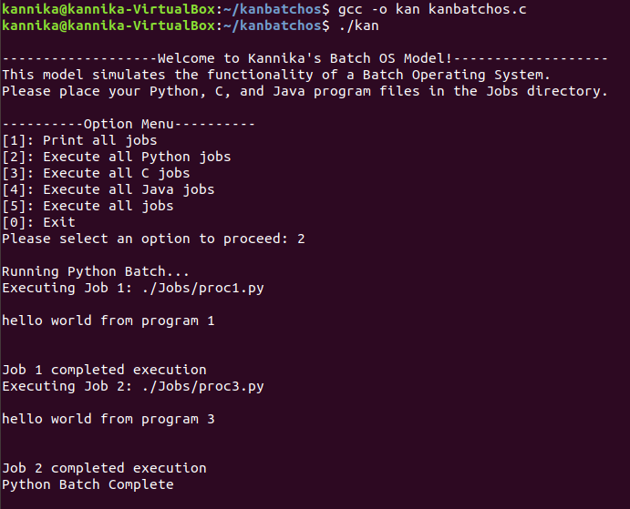

# OperatingSystems Projects
This repo contains projects relating to OS concepts: Multithreading, RAM Page Handling, Ext2-FileSystems.
## Kan Batch OS Model
The Kan Batch OS Model is a Batch Operating System Simulator designed to demonstrate its functionality. Currently, this model supports running batches of Python, C, and, Java program files. Furthermore, this model can be easily modified to support the execution of other program files. This simulator is designed to run in a Linux hosted environment as it uses 'ls' command to collect the list of programming files to execute.
### How it works
Batch OS executes jobs in batches, so this model reflects the design by grouping files of the same programming language, and executing the collected files all at once.  ie: All Python files will be collected and executed together, then all C files will be collected and executed together and so on. Batch OS does not support interactive programs that require user's input during execution. An image of the model being executed is shown below.

<p align="center">
  
</p>

## Multi-Thread Synchronization
Utilizes mutex locks to handle various jobs executing in multiple threads
## RAM Page Handler
The RAM Page Handler is a virtual memory simulator. It manages page table operations and performs page replacements. There are two main tasks in this assignment:<br/>
1. Implement virtual-to-physical address translation and demand paging using a two-level page table <br/><br/>
The main driver for the memory simulator, sim.c, reads memory reference traces in the format produced by the fastslim.py tool from valgrind memory traces. The simulator is executed as ./sim -f -m -s -a where memory size and swapfile size are the number of frames of simulated physical memory and the number of pages that can be stored in the swapfile, respectively. The swapfile size should be as large as the number of unique virtual pages in the trace, which you should be able to determine easily. The format of a page table entry is shown below here: <br />
    | 31 --- Frame Number --- 12 | 11 --- Unused --- 4 | 3 --- Pg ONSWAP | 2 --- Pg REF | 1 --- Pg DIRTY | 0 --- Pg VALID |

The swapfile functions are all implemented in the swap.c file, along with bitmap functions to track free and used space in the swap file, and to move virtual pages between the swapfile and (simulated) physical memory. The swap_pagein and swap_pageout functions take a frame number and a swap offset as arguments. The simulator code creates a temporary file in the current directory where it is executed to use as the swapfile, and removes this file as part of the cleanup when it completes.

2. Implement 4 different page replacement algorithms: FIFO, LRU, Clock, OPT (remove the file that has not been used for the longest time). <br/>
The 4 page replacement algorithms were compared and analyzed on its performance as shown below. <br/><br/>


## Ext2-Filesystem
The Ext2 Filesystem is a project that contains implementation of tools that modify ext2-format virtual disks. This program is written in C that operates on an ext2 formatted virtual disk. The information about the files is stored using an inode data structure where it utilizes indexed access for file accessing methods. The information about directories and its collection of files are stored in structs. Information regarding the files are stored in its own struct designing after the File Control Block. <br/><br/>
The following features were implemented as tools that can be utilized to operate in this filesystem.<br/>
```md
> ext2_cp
> ext2_mkdir
> ext2_ln
> ext2_rm
> ext2_restore
> ext2_checker
> ext2_ls
> ext2_dump
> ext2_corruptor
```
